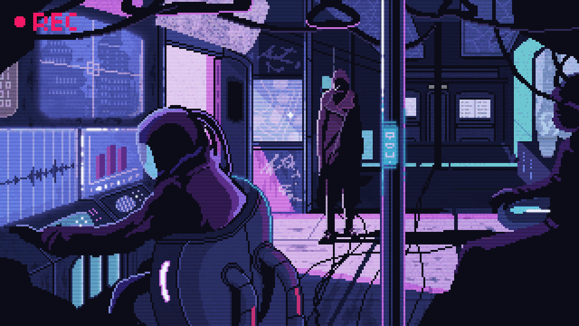

  

  

## 👋 About Me

> I'm an AI/ML researcher and builder who thrives at the intersection of innovation and impact.  
> I specialize in applying machine learning and agentic AI to real-world problems—defending Vision Transformers against adversarial attacks, creating AI-powered student tools, and building smart traffic systems that detect potholes and optimize flow.

- 🎓 PG Scholar in Computer Science @ Christ University  
- 🛡️ Published research on adversarial ML, feedback learning, transformer architectures  
- 🧠 Focus areas: Vision Transformers, NLP with BERT, LLMs, RAG, Agentic AI  
- ⚒️ Builder of real-time systems like AI Student Assistant and pothole detection app  
- 💬 Let's connect: [LinkedIn](https://www.linkedin.com/in/alex-khundongbam) • [Email](mailto:alexkhundongbam260@gmail.com)

---

## 🚀 Featured Projects

<table align="center">
  <thead align="center">
    <tr>
      <td><b>📘 Project</b></td>
      <td><b>⭐ Stars</b></td>
      <td><b>🤝 Forks</b></td>
    </tr>
  </thead>
  <tbody>
    <tr>
      <td><a href="https://github.com/alexkhundongbam/ai-student-assistant"><b>AI Student Assistant</b></a></td>
      <td></td>
      <td></td>
    </tr>
    <tr>
      <td><a href="https://github.com/alexkhundongbam/vision-transformer-defense"><b>ViT Adversarial Defense Toolkit</b></a></td>
      <td></td>
      <td></td>
    </tr>
    <tr>
      <td><a href="https://github.com/alexkhundongbam/pothole-mapping"><b>Pothole Mapping System</b></a></td>
      <td></td>
      <td></td>
    </tr>
  </tbody>
</table>

---

## 🧰 Languages & Tools

  

---

## 📊 GitHub Stats

  

  <picture>
    
  </picture>

## 📊 GitHub Dashboard

  

<table align="center">
  <tr>
    <td>
      
    </td>
    <td>
      
    </td>
  </tr>
</table>

---

## 🧪 Recent Research

- 🔍 **Adversarial Robustness in Vision Transformers**  
  *Presented at ICCI-25 & ICCAC-2024* | Compared C&W, JSMA, PGD attacks with defenses like Feature Squeezing and Adversarial Training.

- 🧠 **BERT-based NLP Toolkits**  
  *Streamlit app for classification, NER, and QA* | Includes interpretability, fine-tuning, and evaluation dashboards.

- 📊 **AI for Policy and Health**  
  - *COVID-19 impact on inflation (ICESC 2024)*  
  - *Depression risk analysis in students (RTMSEE 2024)*  

---

> 🔎 "I build for real-world impact and back it up with research that matters."

<!--
**alex-kh465/alex-kh465** is a ✨ _special_ ✨ repository because its `README.md` (this file) appears on your GitHub profile.

Here are some ideas to get you started:

- 🔭 I’m currently working on ...
- 🌱 I’m currently learning ...
- 👯 I’m looking to collaborate on ...
- 🤔 I’m looking for help with ...
- 💬 Ask me about ...
- 📫 How to reach me: ...
- 😄 Pronouns: ...
- ⚡ Fun fact: ...
-->
